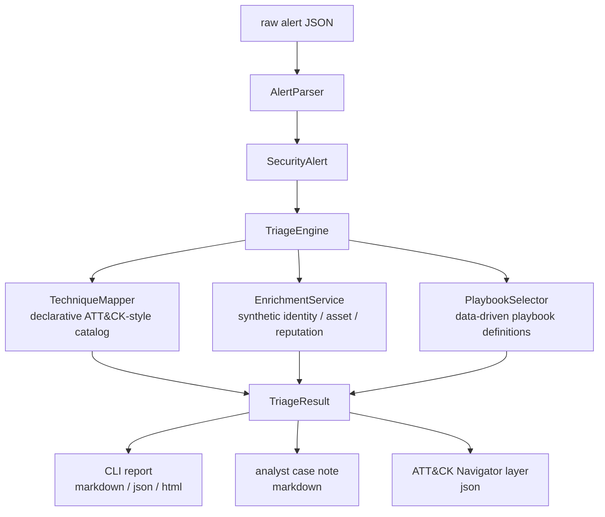

# Architecture

The workbench is built around a deliberately small pipeline:



```text
raw alert JSON
  -> AlertParser
  -> SecurityAlert
  -> TriageEngine
       -> TechniqueMapper (declarative ATT&CK-style catalog)
       -> EnrichmentService (synthetic identity / asset / reputation providers)
       -> PlaybookSelector (data-driven playbook definitions)
  -> TriageResult
  -> CLI report (markdown | json) / generated case note
```

Technique mapping is data-driven: `AttackTechniqueCatalog` declares the
observable-signal-to-technique rules, and `TechniqueMapper` applies them. New
mappings are added as catalog entries rather than new `if` branches.

Playbook recommendations are likewise data-driven. Definitions live as JSON files
under `playbooks/` (validated by `PlaybookValidator`); `PlaybookSelector` chooses
the best fit by category and technique overlap. A built-in `PlaybookCatalog`
mirrors the files so triage and unit tests work from a clean checkout, and a test
guards the two against drift.

Detection content is treated as a separate quality concern. `detections/` holds
Sigma-inspired example rules; `DetectionLinter` enforces required, reviewable
fields (title, status, ATT&CK tag, false-positive notes, test-fixture reference)
with dependency-free structural checks, and the CLI additionally verifies the
referenced fixture exists. These are illustrative examples, not production
detections.

## Commands

All commands build on the same core pipeline:

- `triage` — triage a single alert; renders markdown, json, or html, an analyst case note (`--case-note`), and optionally an ATT&CK Navigator layer (`--attack-layer`).
- `simulate` — run triage over an ordered scenario of synthetic alerts (`ScenarioRunner`) and produce an incident timeline with aggregated technique coverage. Adversary emulation as data; nothing is executed.
- `batch` — triage every alert in a directory and emit aggregate metrics (`TriageSummary`) as json or csv.
- `playbooks list|validate` — list or validate playbook definitions.
- `detections lint` — lint Sigma-inspired detection content.

The simulator, batch metrics, and Navigator export all share `TechniqueFrequency.Tally`
for deterministic technique aggregation.

## Boundaries

- `SecOps.Workbench.Core` contains deterministic domain logic only.
- `SecOps.Workbench.Cli` owns filesystem access and exit codes.
- Tests run the core and selected CLI contracts without external services.

## Design principles

- Keep all default data synthetic.
- Prefer dry-run recommendations over real response actions.
- Keep every public claim backed by code and tests.
- Make gaps explicit: this is an engineering workbench, not production SOC tooling.
